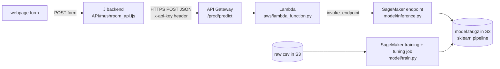

# Mushroom: models, AWS and the API

The plan for the next step after cleaning: train and compare models, train and tune one on AWS, and host the best one so the backend can call it over HTTPS. Written on 9 Oct 2026, deadline 15 Oct.

**What's already done and tested:** the model code (`model/`), the AWS front door (`aws/`), a local copy of the whole API for the backend team, the SageMaker notebook (`3.5MushroomSageMaker.ipynb`, ready to run but not run yet) and 38 tests.
**What's left:** notebooks 3 and 4 (the model comparison itself), running notebook 3.5 on AWS, plugging the J backend into the url, and the retrain-on-push pipeline.

## 1. How it fits together



- **Training** runs `model/train.py` in the SageMaker scikit-learn container. It reads the **raw** csv, does the cleaning steps, fits the model and saves `model.joblib` + `model_meta.json`.
- **Hosting** runs `model/inference.py` in the same container. It checks the input, runs the same cleaning steps and returns the prediction.
- **API Gateway + Lambda** give a fixed public HTTPS url with an api key, because the endpoint itself only accepts requests signed with AWS keys (and AWS Academy keys expire after a few hours).
- **Locally**, `aws/local_api.py` runs the exact Lambda and inference code on `http://127.0.0.1:8081`, with the same routes, key check and answers. The backend can be built against it now and switched to AWS by changing the url and the key.

## 2. Files

| File | What it does |
|---|---|
| `model/mushroom_model.py` | Feature list, the cleaning steps that learn nothing from the data (same as notebook 2.5 steps 1, 3, 4), input checks, and `build_pipeline()` for rf / hgb / logreg |
| `model/train.py` | Training script for SageMaker **and** for local runs (`python model/train.py`). Prints every metric as `name=value` |
| `model/inference.py` | The four functions SageMaker calls when the model is hosted (`model_fn`, `input_fn`, `predict_fn`, `output_fn`) |
| `aws/lambda_function.py` | Passes the HTTPS request to the endpoint and turns its answer into 200 / 400 / 500 / 502 |
| `aws/gateway.yaml` | CloudFormation: API Gateway (`/predict`, `/health`, api key, 5 requests/s and 5000/day limit) + the Lambda |
| `aws/local_api.py` | The whole API on your own laptop, for building the backend |
| `aws/metric_definitions.json` | Regexes SageMaker uses to read the metrics from the training log |
| `aws/examples/*.json` | Example requests. The tests and the docs use these same files |
| `3.5MushroomSageMaker.ipynb` | Runs on SageMaker Studio: upload, baseline job, tuning job, endpoint, API stack |
| `tests/` | 38 tests (section 6) |

`model/` only holds the three files SageMaker needs, because the whole folder is uploaded as the source code of the job.

## 3. The API contract (for the backend)

**Request:** `POST <url>/predict` with headers `Content-Type: application/json` and `x-api-key: <key>`. The body is one mushroom as a JSON object, or a list of 1 to 100 of them.

| Field | Type | Values |
|---|---|---|
| `cap-diameter` | number in cm, ≥ 0 | |
| `stem-height` | number in cm, ≥ 0 | |
| `stem-width` | number in **mm**, ≥ 0 | |
| `spore-print-color` | letter | g k n p r u w |
| `gill-color` | letter | b e f g k n o p r u w y |
| `habitat` | letter | d g h l m p u w |
| `season` | letter | a s u w |
| `ring-type` | letter | e f g l m p r z |
| `cap-shape` | letter | b c f o p s x |
| `stem-surface` | letter | f g h i k s t y |

- Every field may be left out, `null`, `""` or `"missing"`: the model was trained on data with gaps, so a blank is a normal input. Even `{}` gets a prediction.
- Numbers may be sent as text (`"6.42"`), which is what a form gives you. Letters may be upper case or have spaces around them.
- `jumbled_noise_0` / `jumbled_noise_1` are accepted and ignored, so the current J form can be forwarded as it is.
- Any other field name gets a 400. A typo like `cap_diameter` would otherwise be silently treated as a blank and give a worse prediction without anyone noticing.

**Answer 200** (a list if you sent a list):
```json
{"class": "e", "is_poisonous": 0, "probability_poisonous": 0.0753, "threshold": 0.2488, "model_version": "rf-20261009T184817Z"}
```
`class` is `e`/`p`, the same as the J backend's current `{"class": ...}` answer. `probability_poisonous` is what the page can show; `class` already uses the threshold (section 4.4).

**Errors:** always JSON. 400 `{"error": "habitat must be one of [...] or empty, got 'zz'"}` for bad input (the message can be shown to the user). 403 `{"message": "Forbidden"}` for a missing or wrong key, and 403 `{"message": "Missing Authentication Token"}` for a route that doesn't exist (that's how API Gateway says "not found"; only `POST /predict` and `GET /health` exist). 502 `{"error": "model endpoint failed (...)"}` when the endpoint is down or still waking up (try again). 500 when the model itself crashed on the input (a bug on our side, retrying won't help). 429 when the rate limit is hit.

**Health check:** `GET <url>/health` with the key → `{"status": "ok"}`. This doesn't touch the model.

**Try it locally** (from `Mushroom/`, after `python model/train.py` once):
```bash
python aws/local_api.py            # http://127.0.0.1:8081, key: local-dev-key
curl -s -X POST -H "Content-Type: application/json" -H "x-api-key: local-dev-key" --data-binary @aws/examples/full.json http://127.0.0.1:8081/predict
```

### What the J backend needs to change
1. **Allow blank numbers.** `validate_numeric` now rejects an empty `cap-diameter`. A blank should be passed on as `""` or left out; the model handles it.
2. **Call the model instead of the stub `predict`.** J's socket library has no HTTPS, so call `curl` through the shell. **Never paste user input into the command line** (a `"` in a form field would become a shell command). Write the JSON body to a temp file and pass it with `--data-binary @file`, or feed it on stdin with `--data-binary @-`:
   `curl -s -m 30 -X POST -H "Content-Type: application/json" -H "x-api-key: $MUSHROOM_API_KEY" --data-binary @/tmp/req.json "$MUSHROOM_API_URL"`
3. **Keep the url and key out of git:** read them from environment variables (`MUSHROOM_API_URL`, `MUSHROOM_API_KEY`).
4. **Timeout of 30 s** (`-m 30`). On a 502 (endpoint off or restarting), retry once. Don't retry a 400 or 500.
5. **Pass the answer through**, or at least `class` and `probability_poisonous`. On a 400, show the `error` text to the user.

## 4. Decisions, and the paths we didn't take

### 4.1 The imputer moves inside the model
`mushroom_clean.csv` has measurements filled in by an IterativeImputer that saw all 5000 rows, including the ones we would test on. So the models train on the **raw** csv: `prepare()` does the steps that don't learn anything (rename, drop the noise columns, stemless rule, "missing" category), and the imputer is the first step of the sklearn `Pipeline`. In cross-validation it is then refit on every training fold. This also means the hosted model can fill in a blank measurement, which it couldn't if we trained on the clean file.

A test (`test_prepare_matches_the_cleaning_notebooks`) checks that `prepare()` gives exactly the same categories and known measurements as `mushroom_clean.csv`, so the two can't drift apart.

**First observation:** the random forest with the notebook 2 settings gets cv AUC 0.827 ± 0.014 here, against 0.840 in notebook 2. The setup differs in two ways (imputer inside the folds, CV on 80% instead of 100% of the rows) and the gap is within one standard deviation. Notebook 3 should test which of the two causes it before we say anything about leakage.

### 4.2 `prepare()` stays outside the pickled pipeline
The pickle only contains sklearn and numpy objects, so it loads anywhere with the same sklearn version, without our code (tested). If `prepare()` were a step inside the pipeline, the pickle would need our module under exactly the same import path everywhere (notebook, container, laptop), which breaks easily.

### 4.3 Container and SDK version
- **Container: scikit-learn 1.9-0** (sklearn 1.9.0, pandas 2.2.3, numpy 2.5.1, Python 3.12), the newest supported one. 1.2-1 is out of support. A pickle must be loaded by the same sklearn version that made it, so **we train on SageMaker and host in the same container**. A model trained on a laptop (sklearn 1.8) is only for local use.
- **Fallback: 1.4-2** (sklearn 1.4.2), in case the 1.9-0 image isn't available in our region. All tests pass on its versions too.
- **SDK v2** (`sagemaker<3`) with the image address written out. v3 is the new SDK but works very differently from what the AWS course teaches, and v2 doesn't know the name `1.9-0` yet. That's why the image address is written out.
- **Not taken: SageMaker's built-in XGBoost.** It wants a csv with only numbers and the label in the first column. The one-hot encoding and imputation would then need a second container in front of the endpoint (an "inference pipeline"), and the endpoint couldn't take the raw form. Our own script in the scikit-learn container takes the raw form and is the same code we test locally. XGBoost is still worth comparing in notebook 3.

### 4.4 Threshold: recall on poisonous comes first
Positive class = poisonous. Calling a poisonous mushroom edible is the dangerous mistake (a false negative), so we fix the **recall** we want and accept the precision that comes with it. `train.py` picks the threshold on out-of-fold predictions on the training part (never on the test part): the highest threshold that still catches `--target-recall` of the poisonous ones (default 0.90).

First run (random forest, 200 trees): threshold 0.249, test recall 0.90, precision 0.51, accuracy 0.63. That's a lot of edible mushrooms flagged as poisonous. The same run has train AUC 0.973 against test AUC 0.850, so the forest also overfits (bigger leaves are one of the things the tuning job tries). **This trade-off is the main thing to discuss in notebook 3**: a precision-recall curve, and which recall we defend (0.90? 0.95?). The target is one argument, so changing it doesn't need code changes.

The threshold is rounded **down** to 4 decimals, so rounding can't push the recall under the target. The answer's `class` is decided on the same rounded probability it shows, so the two never contradict each other.

### 4.5 We ship the model we measured
The course's "retrain on all data before deploying" would give a model the test numbers and the threshold were never measured on. Its probabilities shift a little, so its recall at that threshold is unknown. For a model whose job is "don't miss a poisonous mushroom" we prefer a guarantee we checked, so `train.py` ships the 80% model by default. `--refit-all 1` retrains on all 5000 rows if we decide otherwise in notebook 4.

### 4.6 Hosting: normal endpoint + API Gateway
- **Normal endpoint on `ml.t2.medium`** (`SERVERLESS = False` in the notebook): the smallest machine, always warm, billed per hour. Delete it when we don't need it; the url stays the same.
- **Tried and failed: serverless inference** (pay per request). On 10 Oct the endpoint crashed at startup. The scikit-learn container writes its web server config to `/etc/sagemaker-nginx.conf`, and serverless endpoints run the container on a read-only file system (`PermissionError: [Errno 13] Permission denied: '/etc/sagemaker-nginx.conf'` in the CloudWatch log). That path is fixed inside AWS's container code, so this container can't run serverless. Our own code never got to load.
- **API Gateway + Lambda** instead of letting the J backend sign requests with AWS keys: AWS Academy keys expire after a few hours, so the backend would stop working during the two weeks of grading. An api key never expires, and the usage plan caps requests so a leaked key can't burn the budget.
- **Not taken:** loading the model inside the Lambda itself (sklearn + pandas don't fit in a normal Lambda package, and it would no longer be "hosted on SageMaker"); hosting the model on the same VM as the J backend (allowed, but then AWS would only be used for training).

## 5. Plan for notebooks 3 and 4

**3MushroomPredict.ipynb** (one notebook, or one per model, since the assignment asks for "one file per model per dataset"):
1. Load the **raw** csv, `prepare()` it (import from `model/`), and make the stratified 80/20 split with `random_state=42`: the same split `train.py` uses.
2. **Quick first model:** the forest from notebook 2 (`python model/train.py` already does this; show its numbers).
3. **PyCaret:** `setup(target='is_poisonous', session_id=42, fold_strategy='stratifiedkfold')` → `compare_models(sort='AUC')`. PyCaret 3.3.2 only runs on Python 3.9–3.11, so this needs its own venv with Python 3.11 (installed on Aarya's laptop). (outside the slides)
4. **At least 2 tuned models, each with a reason:** random forest (bagging, robust to noisy labels), HistGradientBoosting and/or XGBoost (boosting, handles NaN natively), logistic regression (simple linear baseline, needs log1p + scaling). Tune with `RandomizedSearchCV` on CV, never on the test set.
5. **Threshold:** precision-recall curve on out-of-fold predictions, choose the target recall and explain it.
6. **Error analysis:** look at the false negatives (poisonous called edible). Are they the stemless / giant groups from the EDA, or the rows with the most gaps?
7. Test the leakage question from 4.1 (imputer inside vs outside the folds, on the same folds).
8. Optional extension: K-Means on the scaled measurements, compared with the class and the stemless/giant groups.

**3.5MushroomSageMaker.ipynb:** run it on AWS (section 7), keep the outputs, fill in the "to write after the run" cells with the real numbers.

**4MushroomCompare.ipynb:** one table with every model on the same test set (accuracy, precision, recall, F1, ROC-AUC, PR-AUC, train vs test AUC, training time), including the AWS jobs from `results/sagemaker_tuning.csv` and `results/sagemaker_best.json`. ROC + PR curves in one plot, confusion matrices, fold-by-fold comparison. A difference smaller than the fold std is noise. The conclusion says which model is hosted and why. If that isn't the AWS forest, add its `--model` and parameters to `train.py` (rf, hgb and logreg are already there) and run the training cell again.

## 6. Tests

From `Mushroom/`: `python -m pytest tests -q` (about 20 seconds). They prove:
- `prepare()` gives the same result as the cleaning notebooks; the stemless rule works in both directions
- `train.py` runs exactly the way a SageMaker job starts it (data and output folders through the `SM_*` variables), for rf, hgb and logreg
- the metric regexes find every metric in the log (otherwise the tuning job has nothing to optimise)
- the saved pipeline loads in a Python that can't see our code
- every example in `aws/examples/` gets the documented answer; 200 real rows sent as JSON get exactly the same probabilities as the pipeline gives directly; 11 kinds of bad input each get a clear 400 message
- the Lambda: 200 / 400 / 500 (model crash) / 502 (endpoint down) / base64 body (also broken base64) / health check that doesn't call the model; and it doesn't leak internal error text
- the local API over real HTTP: key check (403), unknown route or wrong method (403 "Missing Authentication Token", like API Gateway), predict, batch, error
- `train.py` accepts the extra arguments a tuning job adds (`--_tuning_objective_metric`). Without that every tuning job would have crashed; the code review caught it

Also checked on 9 Oct (not part of `pytest`): all 38 tests pass on Python 3.12 + sklearn 1.8 (our laptops), on the exact versions of the 1.9-0 container and on the 1.4-2 fallback. `gateway.yaml` passes `cfn-lint`. Every cell of notebook 3.5 was run against the real SageMaker SDK v2.257.7 with AWS stubbed out, so every SDK call has valid arguments. The curl commands above were run against `local_api.py`.

**Not tested (needs our AWS account):** the real training job, the endpoint, the stack. Section 8 has what could go wrong there.

## 7. Running it on AWS
1. AWS Academy → start the lab → SageMaker Studio → clone the repo (Git button) → open `Mushroom/3.5MushroomSageMaker.ipynb`.
2. Run the cells in order. The baseline job takes a few minutes; the tuning job (12 jobs, 2 at a time) about 20–30 minutes.
3. The stack cell prints the url. The key is saved in `~/mushroom_api_key.txt` in Studio, **not** in the notebook output. Share both with the backend team in private.
4. Commit the notebook with its outputs plus `results/sagemaker_*.{csv,json}`.
5. **Turn off:** the last cell deletes the endpoint (the url and key stay). **Turn on:** setup cells + the "Host the model" cell.

Rough cost: training is a few `ml.m5.large` jobs of a few minutes each (cents). The `ml.t2.medium` endpoint is billed for every hour it runs, so delete it when not needed. Check the lab budget before the tuning job.

## 8. Risks and open questions
| Risk | What we do |
|---|---|
| AWS Academy might block some of this (CloudFormation, API Gateway keys, Lambda using the LabRole, `ml.t2.medium`) | Find out by running notebook 3.5 to the end. Fallbacks: another instance type (`ml.m5.large`); build the API in the console with the same settings as `gateway.yaml` |
| The endpoint costs money every hour during the two weeks of grading | Check the lab budget; turn it off with the TURN_OFF cell when nobody needs it |
| Serverless cold start vs the 24 s Lambda timeout | Gone: serverless doesn't work with this container (section 4.6) |
| The 1.9-0 image doesn't exist in our region | `IMAGE_TAG = '1.4-2-cpu-py3'` (tested) |
| Precision is low at 90% recall | That's the data (noisy labels, AUC around 0.85). Discuss it in notebook 3, don't hide it |
| A teammate's VS Code tab overwrites a notebook | Close or save the tab before someone else edits that file |
| The url or key end up in git | Environment variables in the backend; the notebook only prints the last 4 characters |

## 9. Timeline (deadline Thu 15 Oct, midnight)
| Day | What |
|---|---|
| Fri 9 Oct | this plan, model code, tests, notebook 3.5 ready ✔ |
| Sat 10 | run notebook 3.5 on AWS (it has the most unknowns). Backend starts against `local_api.py`. Notebook 3: baseline + PyCaret |
| Sun 11 | notebook 3: tuned models, threshold, error analysis |
| Mon 12 | notebook 4; choose the final model; retrain it on AWS if it isn't the forest; backend switches to the AWS url |
| Tue 13 | retrain-on-push pipeline (GitHub Actions: run `pytest`, then start the SageMaker training job); frontend; hosting of the J backend |
| Wed 14 | README, GenAI disclosure, review pass, rerun everything |
| Thu 15 | buffer, upload on Canvas |

**Retrain-on-push (later):** a GitHub Actions workflow on pushes that touch `Mushroom/`: run `pytest`, then start the training job and point the endpoint at the new model **only if** its cv_auc isn't worse than the current model's. This needs AWS keys as GitHub secrets, and AWS Academy keys expire, so to be decided: refresh the secret before the demo, or let CI only train and test and keep the deploy as one notebook cell.
